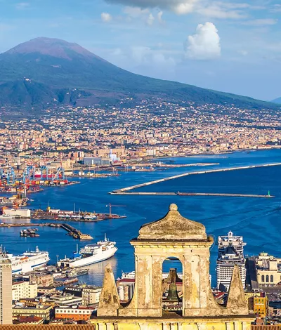
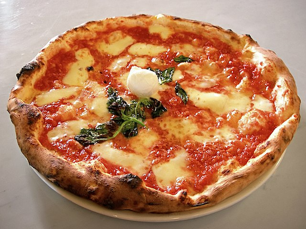
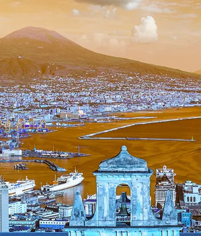
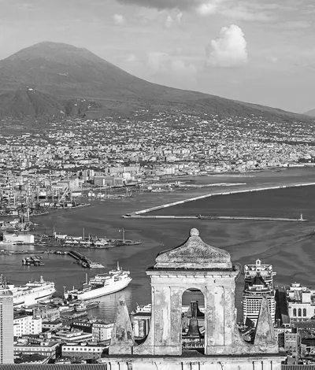
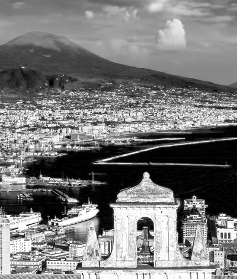
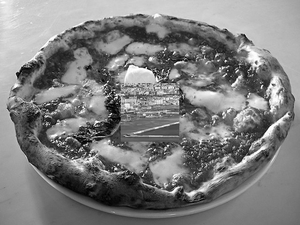
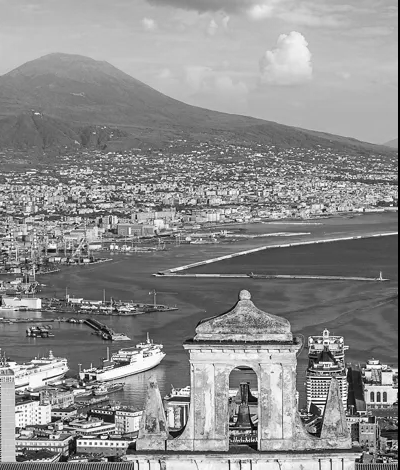
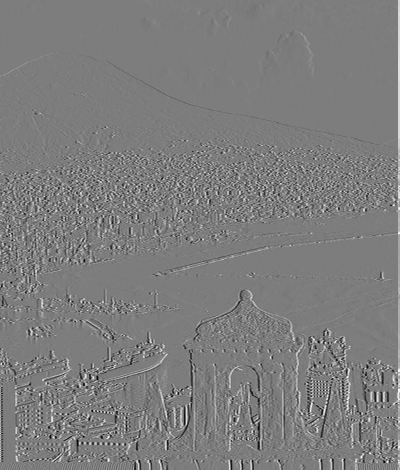

# Problem Set 0: Images as Functions

## Question 1 - Input Images

### A

Two interesting images:

|<br>Image 1|<br>Image 2|
|:-:|:-:|

## Question 2 - Colour Planes

### A

Swap the red and blue pixels of image 1:



### B

Create a monochrome image (img1_green) by selecting the green channel of image 1:


**img1_green**

### C

Create a monochrome image (img1_red) by selecting the red channel of image 1:


**img1_red**

### D

```
Which looks more like what you’d expect a monochrome image to look like? Would you expect a computer vision algorithm to work on one better than the other?
```

**img1_green** looks more like what I would expect to see in a monochrome image. There are no areas that lack detail, this is in contrast to **img1_red** where there is no/little detail in the sea (it appears uniform black). Therefore I would expect CV algorithms to work better on **img1_green**.

## Question 3 - Replacement of Pixels

### A

Take the ~~inner~~ center square region of 100x100 pixels of monochrome version of image 1 and insert them into the center of monochrome version of image 2:



## Question 4 - Arithmetic and Geometric operations

### A

```
What is the min and max of the pixel values of img1_green? What is the mean? What is the standard deviation?  And how did you compute these?
```

Results:
- img1_green max pixel value: 255
- img1_green min pixel value: 0
- img1_green mean pixel value: 141.94
- img1_green std dev: 51.16

Results were calulcated with the numpy library and the following functions:
- `image_1_g_max = np.max(image_1_g)`
- `image_1_g_min = np.min(image_1_g)`
- `image_1_g_mean = np.mean(image_1_g)`
- `image_1_g_std = np.std(image_1_g)`

### B

Subtract the mean from all pixels, then divide by standard deviation, then multiply by 10 (if your image is 0 to 255) or by 0.05 (if your image ranges from 0.0 to 1.0). Now add the mean back in:


### C

Shift img1_green to the left by 2 pixels:



### D

Subtract the shifted version of img1_green from the original, and save the difference image.:



```
What do negative pixel values mean anyways?
```

Negative values indicate the rate of change of **img1_green** in a certain direction. The image is the derivative of **img1_green** in the x direction.

## Question 5 - Noise

### A

Take the original colored image (image 1) and start adding Gaussian noise to the pixels in the green channel. Increase sigma until the noise is somewhat visible:


Sigma used: 3 (`image_1_noise_g = gaussian_filter(image_1_noise_g, 3)`)

### B

Now, instead add that amount of noise to the blue channel:


### C 
Which looks better? Why?

According to this [Stack Overflow](https://photo.stackexchange.com/questions/10760/why-is-the-blue-channel-the-noisiest) answer:

```
most scene illumination (sunlight, incandescent) is deficient in blue light relative to green and red.
```