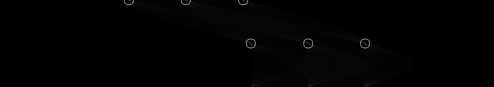
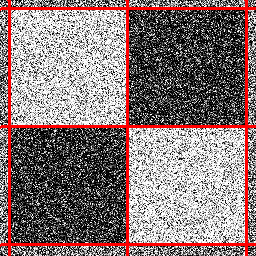
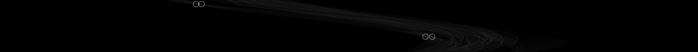
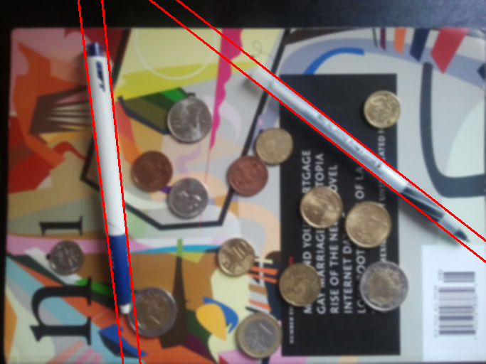
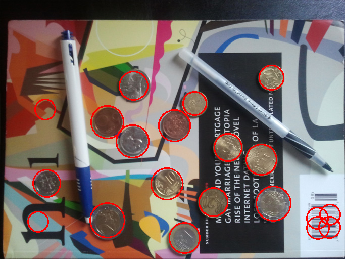
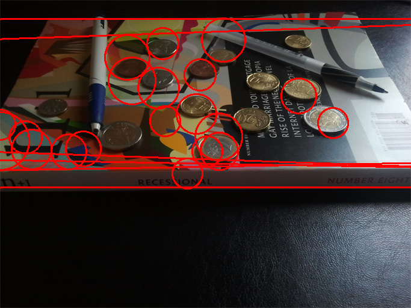
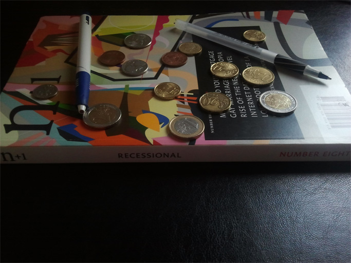

# Problem Set 1: Edges and Lines

## Question 1

### A

Edge image generated using Canny edge detector:


## Question 2

### A

Hough accumulator array:


### B

Hough peaks:



### C

Hough lines:


### D

I used the following parameters:
```
Theta=[0, 1, 180]
ThetaBins=181
RhoResolution=1
RhoBins=1025
number of peaks: 6
```
I used a Theta bin for each degree between 0° and 180°, which was enough resolution to cover all angles and also simple to implement (by using `int()`).

Rho bins was calculated from the maximum possible rho value which is `length` + `width` of the image. This was then doubled to account for negative values.

Number of peaks was manually set to 6 for the 6 lines in the image, this can be changed to find more/less lines in the image.

## Question 3

### A

Smoothed image:


### B

Using an edge operator of your choosing, create a binary edge image for both the original image and the smoothed version above:

|<br>Edge Detector (Original)|<br>Edge Detector (Smoothed)|
|:-:|:-:|

### C

Now apply your Hough method to the smoothed version of the edge image. Your goal is to adjust the filtering, edge finding, and Hough algorithms to find the lines as best you can in this test case:

|<br>Hough Peaks|<br>Hough Lines|
|:-:|:-:|

## Question 4

### A

Smoothed monochrome image:


### B

Edge image:


### C

Hough peaks:



Hough lines:


This part was hard. Turns out my model was working only for vertical and horizontal lines, but none between those angles. For some reason I had to shift the theta iterations to between -90 and 90 degrees, and then subtract the output theta values from 180 degrees at the end, to achieve the same output as OpenCV's HoughLines() function. But in the end this fixed my problems and detected the lines perfectly.

## Question 5

### A

|<br>Smoothed Image|<br>Edge Detector|
|:-:|:-:|

### B

Hough circles:


This procedure was surprisingly more normal. Just had to rotate the full 360° and make sure I plotted everything correctly (and correct for that sneaky `180 - peak[1]`).
As the two images were mapped to each other, I could take directly the (x,y) coordinates from the local maxima in (a,b) space.

## Question 6

### A

Hough lines:


### B

Other objects also appear as lines, as they are more generally the boundary between objects.

### C

I filtered out any lines that weren't parallel to another line, and weren't within `x` pixels:



## Question 7

### A

Hough circles:



### B

First off, I set the minimum radius to 20, so that fine grain stuff e.g. noise wouldn't be searched for. Then I modified the algorithm to accomodate different radius sizes, by adding a 3rd dimension to the accumulator array, and for each edge pixel voting once for each radius size.

It works quite well and I am sure that by further tweaking the parameters it would be possible to get rid of the incorrect circles.

## Question 8

### A

Hough lines and circles:



### B

I applied a perspective transform to the input image to make the coins round. Here is the original:



And here is the transformed image:


### C

Fixed Hough lines and circles:


I could improve the results by tweaking the parameters, however this is rather time consuming so I will leave it like this for now.