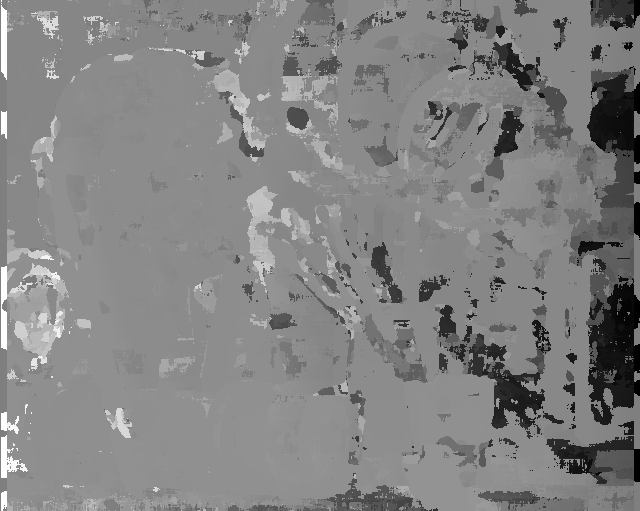
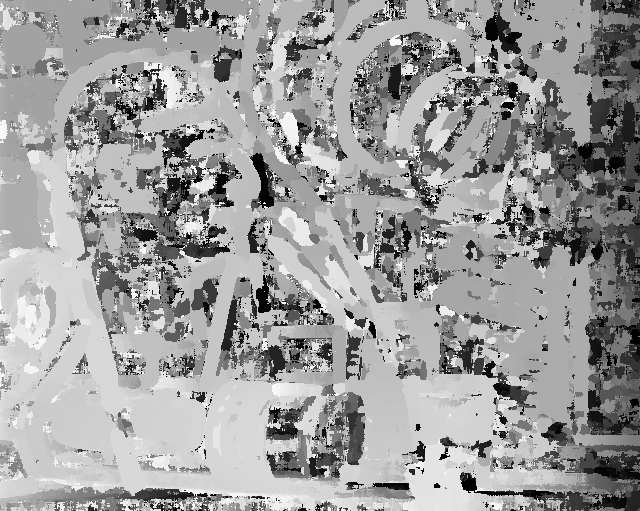

# Problem Set 2: Window-based Stereo Matching

## Question 1

### A

Disparity maps:

| SSD Disparity (L-->R)| SSD Disparity (R-->L)|
|:-:|:-:|

They both have the same polarity due to the use of the `inv=1`flag used for the (R-->L) disp map.

## Question 2

### A

Disparity maps:

| SSD Disparity (L-->R)| SSD Disparity (R-->L)|
|:-:|:-:|

### B 

My result is a lot more noisy, e.g. at object edges. Window size and similarity function (in this case SSD) have an effect on the output, after testing I emperically determined that a window size of [15,15] gives the best results. Furthermore, there is occlusion at object edges as certain regions are only visible in one image but not the other.

## Question 3

### A

Disparity maps of input images with added Gaussian noise:

| SSD Disparity with Gaussian Noise Added (L-->R)| SSD Disparity with Gaussian Noise Added (R-->L)|
|:-:|:-:|

Gaussian noise was added to both images (A sigma of 9 was used). The output is not as smooth as the original and contains more noise.

### B

Disparity maps of R input image with contrast increased by 10%:

| SSD Disparity (L-->R)| SSD Disparity (R-->L)|
|:-:|:-:|

Again, the output is not as smooth as the original and contains more noise.

## Question 4

### A

Disparity maps:

| NCORR Disparity (L-->R)| NCORR Disparity (R-->L)|
|:-:|:-:|

Results are improved compared to SSD method. However there is still a lot of noise, and the matching algorithm does not handle occlusions well. Due to this, there are a lot of noisy regions in occluded areas of the image, and the dynamic range of the disparity map is affected by noisy maxima and minima, making it hard to distinguish between individual objects.

### B

Disparity maps of input images with Gaussian noise:

| NCORR Disparity (L-->R)| NCORR Disparity (R-->L)|
|:-:|:-:|

Disparity maps of R input image with contrast increased by 10%:

| NCORR Disparity (L-->R)| NCORR Disparity (R-->L)|
|:-:|:-:|

The NCORR images with added Gaussian noise seem to be more affected than the SSD images. However, the contrasted set of images appear to be unaffected by the change in contrast. The disparity maps are very similar with only a negligible difference between the two. Therefore, the template matching algorithm can be considered robust to changes in contrast.

## Question 5

### A

Disparity maps:

| NCORR Disparity (L-->R)| NCORR Disparity (R-->L)|
|:-:|:-:|

Tests were run to find an optimal window size. After running tests, an optimal window size of [15,15] was determined. If the window is too small, then the computed disparity map becomes noisy because there are not enough features in the window for a succesful match. Inversely, if the window size is too big then disparity maps become "washed out" and lose high frequency detail. This is due to a larger window being more likely to contain a depth discontinuity, leading to an inaccurate disparity being computed and the disparity map becoming "washed out".

It is also important to consider the baseline between images. We want the disparity map to show objects that are further away as darker, and objects that are closer as brighter. Therefore, I added a flag to each function to indicate if the images are flipped around or not, via the "inv=1" option (default is L --> R, for R --> L the "inv=1" needs to be set). When this flag is used, then the computed disparity map is negated before being normalized to [0,255]. 

ADDENDUM: I added a "disp_range" parameter to my disparity_ncorr.py function. This limits the width of strip_R to disp_range, and prevents anomalies affecting the dynamic range of the compute disparity map. I computed a seperate disparity map for a range of "disp_range" values, and as the value increases, objects which are closer to the camera become smoother. The optimum value appears to be 250 pixels, which seems to be the approximate difference between the foremost objects in the R and L image. This value would need to be changed if the baseline between the two images changes.

I therefore achieved optimum results with a disp_range value of 250 and a template size of 15,15. These values are used as the defaults in my function.

See "ncc_test_1_L.png", "ncc_test_1_R.png", "ncc_test_2_L.png" and "ncc_test_2_R.png" for my best results:

| ncc_test_1_L.png (L-->R)| ncc_test_1_R.pn (R-->L)|
|:-:|:-:|

| ncc_test_2_L.png (L-->R)| ncc_test_2_R.png (R-->L)|
|:-:|:-:|