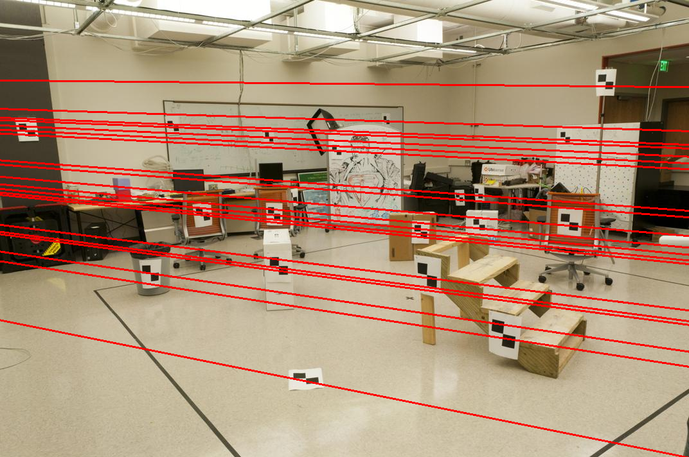

# Problem Set 3: Geometry

## Question 1

### A

Projection Matrix M:
```
[[ 0.76785834 -0.49384797 -0.02339781  0.00674445]
 [-0.0852134  -0.09146818 -0.90652332 -0.08775678]
 [ 0.18265016  0.29882917 -0.07419242  1.        ]]
```
```
Last <x,y,z> point:
 [1.2323 1.4421 0.4506 1.    ]
<u,v> projection:
 [ 0.14190586 -0.45183985  1.        ]
residual:
 (0.0013058578875105864, 0.0008601491826675245)
```

### B

Average residual for set size k:
```
{8: 54.39699999999999, 12: 9.936000000000002, 16: 8.856}
```

K size 16 _usually_ produces the best result. I guess that sometimes a too narrow set of points (in a spatial sense) are selected, leading to a biased M matrix.

Best M:
```
[[-2.33444568e+00 -1.08409788e-01  3.36167456e-01  7.36784208e+02]
 [-2.30936393e-01 -4.79481474e-01  2.08969314e+00  1.53505539e+02]
 [-1.26382400e-03 -2.06754310e-03  5.12567068e-04  1.00000000e+00]]
```
```
set size k: 
 16
residual: 
 1.21
```

### C

Camera Coordinates C:
```
[305.8274411  304.19542904  30.13706486]
```

## Question 2

### A

Fundamental Matrix F (Least Squares Solution):

```
[[-6.60698417e-07  7.91031621e-06 -1.88600198e-03]
 [ 8.82396296e-06  1.21382933e-06  1.72332901e-02]
 [-9.07382302e-04 -2.64234650e-02  9.99500092e-01]]
```

### B

Fundamental Matrix F (SVD Solution):

```
[[-5.36264198e-07  7.90364771e-06 -1.88600204e-03]
 [ 8.83539184e-06  1.21321685e-06  1.72332901e-02]
 [-9.07382264e-04 -2.64234650e-02  9.99500092e-01]]
```

### C

Epipolar lines:

|<br>Epipolar Line Projections (pic_a)|<br>Epipolar Line Projections (pic_b)|
|:-:|:-:|

### D

Transform Matrix T_a:
```
[[ 0.00253013  0.         -1.41421356]
 [ 0.          0.00434341 -1.41421356]
 [ 0.          0.          1.        ]]
```

Transform Matrix T_b:
```
[[ 0.0022932   0.         -1.41421356]
 [ 0.          0.00407672 -1.41421356]
 [ 0.          0.          1.        ]]
```

Normalized Fundamental Matrix F_hat:
```
[[  0.98574094  -9.70833965  -1.29399318]
 [ -5.87440319   1.04303733 -53.77656235]
 [ -6.77998107  47.49645997   1.        ]]
```

### E

Improved Fundamental Matrix F:
```
[[ 5.71933957e-06 -9.66978043e-05  2.53206011e-02]
 [-6.05921672e-05  1.84689051e-05 -1.91377377e-01]
 [ 3.38104151e-04  2.59523165e-01 -5.80819930e+00]]
```

|<br> Improved Epipolar Line Projections (pic_a)|<br>Improved Epipolar Line Projections (pic_b)|
|:-:|:-:|