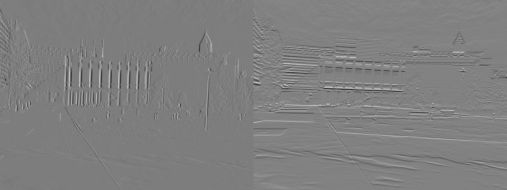
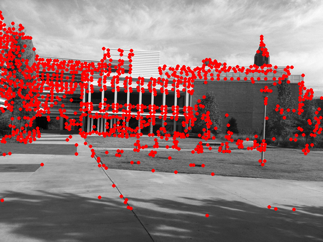
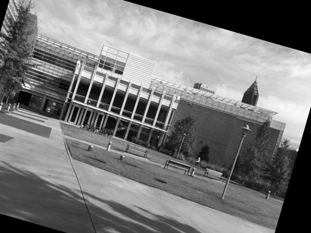
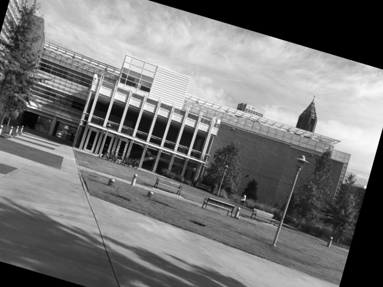

# Problem Set 4: Harris, SIFT, RANSAC

## Question 1

### A

transA.jpg Gradient Pair (I_x, I_y) Image:


simA.jpg Gradient Pair (I_x, I_y) Image:



### B

transA.jpg/transB.jpg Harris Values:

|<br>transA.jpg|<br>transB.jpg|
|:-:|:-:|

simA.jpg/simB.jpg Harris Values:

|<br>simA.jpg|<br>simB.jpg|
|:-:|:-:|

### C

transA.jpg/transB.jpg Harris Corners:

|<br>transA.jpg|<br>transB.jpg|
|:-:|:-:|

simA.jpg/simB.jpg Harris Corners:

|<br>simA.jpg|<br>simB.jpg|
|:-:|:-:|

Remarks:
- Finding the maximum number of features from the Harris value map was improved massively by using the mean pixel intensity to compute the threshold value.

## Question 2

### A

transA.jpg/transB.jpg Interest Points and Angles:


simA.jpg/simB.jpg Interest Points and Angles:


### B

transA.jpg/transB.jpg Putative Matches:


simA.jpg/simB.jpg Putative Matches:


## Question 3

### A

transA.jpg/transB.jpg Filtered Matches (RANSAC Translational Transform):


Translational Transform Matrix S:
```
[[   1    0 -130]
 [   0    1  -75]]
 ```

### B

simA.jpg/simB.jpg Filtered Matches (RANSAC Similarity Transform):


Similarity Transform Matrix S:
```
[[  0.98371707  -0.27971742  36.52251825]
 [  0.27971742   0.98371707 -60.54754571]]
```

### C

simA.jpg/simB.jpg Filtered Matches (RANSAC Affine Transform):


Affine Transform Matrix S:
```
[[  0.97605686  -0.25925926  34.60381594]
 [  0.293054     0.97530864 -61.70295548]]
```

### D

simA.jpg Transformed (Similarity):



simA.jpg/simB.jpg Overlay (Similarity):


### E

simA.jpg Transformed (Affine):



simA.jpg/simB.jpg Overlay (Affine):


Remarks:
- Both transforms gave similar results, due to the absence of warping between simA.jpg and simB.jpg, therefore rendering the warping component of the Affine Matrix translation useless.
- This can be seen just by comparing the Transform Matrices visually, both contain similar values.
- Transformation accuracy seems to be improved around feature points, therefore to ensure a more accurate Transform Matrix computation an even spread of matched features that cover the entire image should be aimed for.