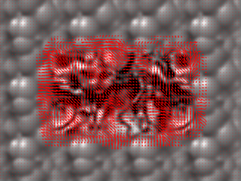
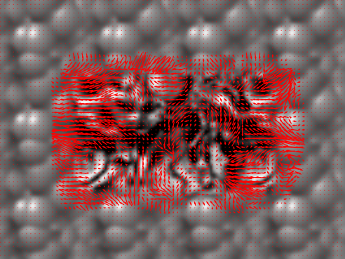

# Problem Set 5: Optic Flow

## Question 1

### A

`Shift0.png` and `ShiftR2.png` optical flow:

`Shift0.png` and `ShiftR2U5.png` optical flow:

I had to weigh the kernel with a gaussian and increase the size of the window to avoid the "aperture" effect.

### B

`Shift0.png` and `ShiftR10.png` optical flow:

`Shift0.png` and `ShiftR20.png` optical flow:

`Shift0.png` and `ShiftR40.png` optical flow:

The algorithm falls apart the bigger the displacement.This is because LK cannot handle larger displacements.

## Question 2

### A

Gaussian pyramid:

### B

Laplacian pyramid:

## Question 3

### A

`DataSeq1` optical flow:

`DataSeq1` difference:

`DataSeq2` optical flow:

`DataSeq2` difference:

## Question 4

### A

`TestSeq` iterative optical flow:

`TestSeq` iterative difference:

### B

`DataSeq1` iterative optical flow:

`DataSeq1` iterative difference:

### C

`DataSeq2` iterative optical flow:

`DataSeq2` iterative difference:

## Question 5

### A

`Juggle` iterative optical flow:

`Juggle` iterative difference:

