# Problem Set 5: Optic Flow

## Question 1

### A

Image patch used for tracking:

Image frame #28:

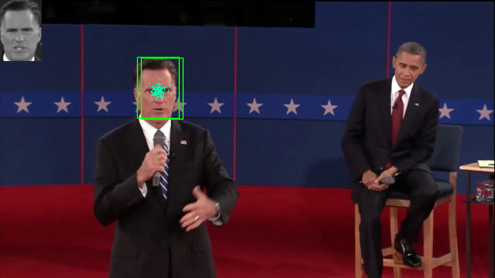

Image frame #84:

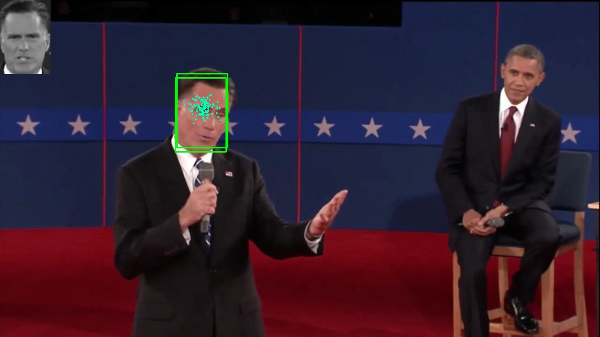

Image frame #144:

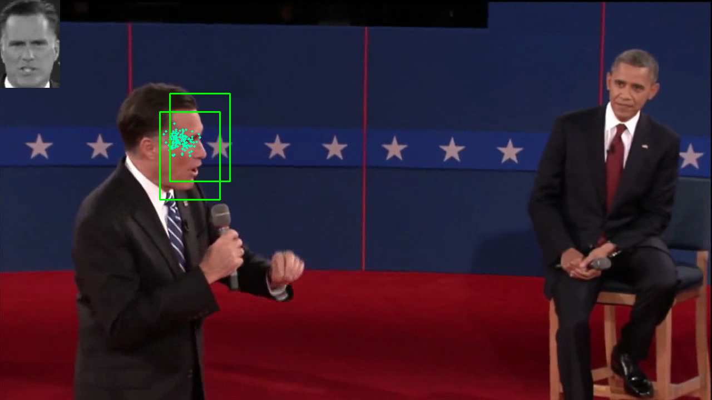

### B

- Smaller window only concentrates on face and misses out on other features such as hair, etc.
- Larger window takes more context in, e.g. hair, however also takes in other potentially (un)wanted features such as the background

### C

- Small theta_mse (sim_std) values lead to a "locked on" behaviour, after initialization the model stays put and does not jump to other potential candidates.
- Large theta_mse (sim_std) values lead to a "noisy behaviour", the particles are more spread out and the estimated state jumps around the image.

### D

- A smaller number of particles (~10) leads to a fast but inaccurate behaviour, as there are not enough samples to find the correct candidate.
- A larger number of particles (~1000) leads to a much more accurate result, however the performance (fps) is vastly reduced. 
- An optimal setting of ~200 particles was found running on a MacBook Pro M1 2021

### E

Image frame #14:

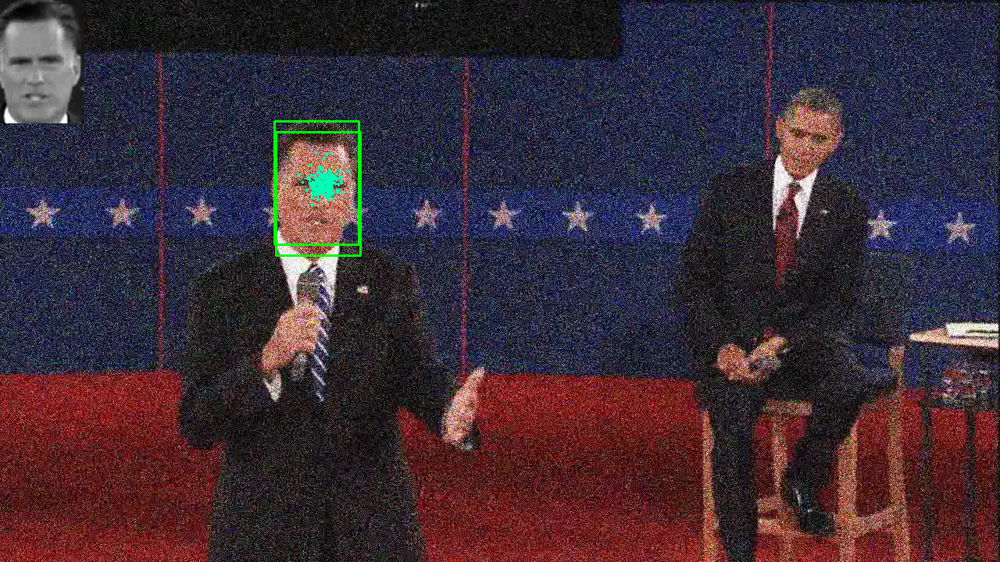

Image frame #32:

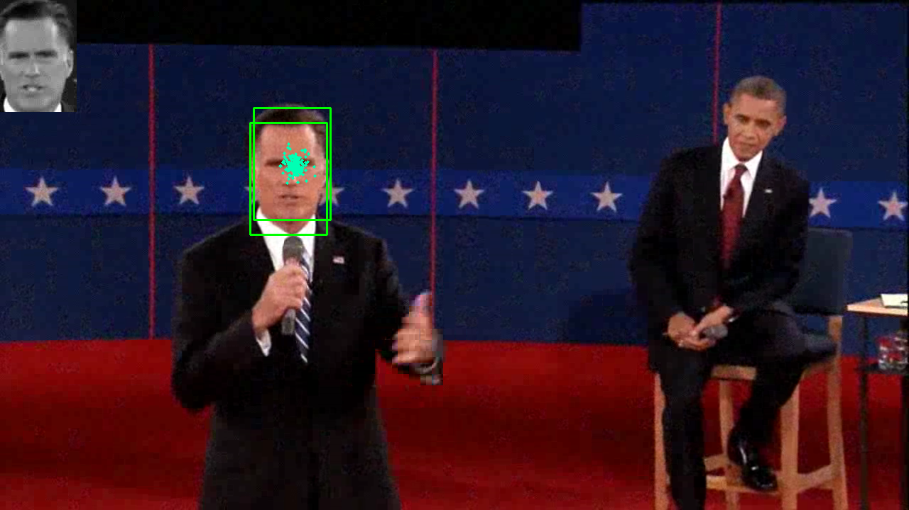

Image frame #46:

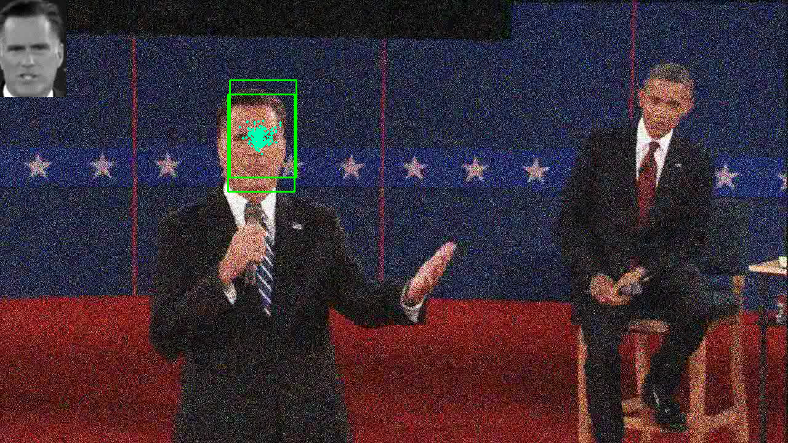

## Question 2

### A

Image patch used for tracking:

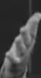

Image frame #15:

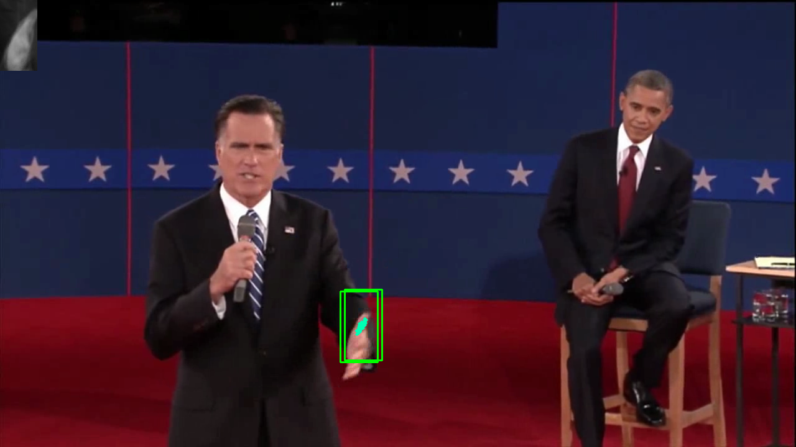

Image frame #50:

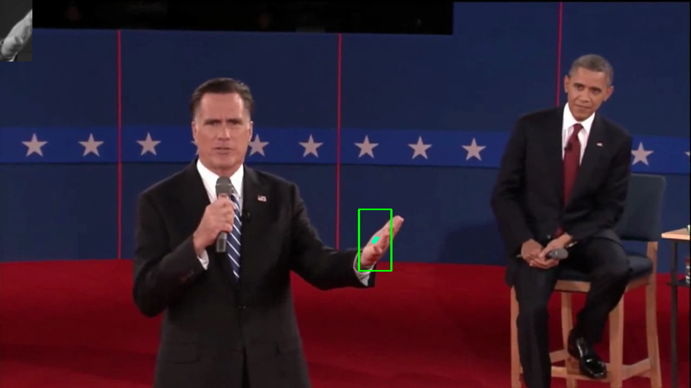

Image frame #140:

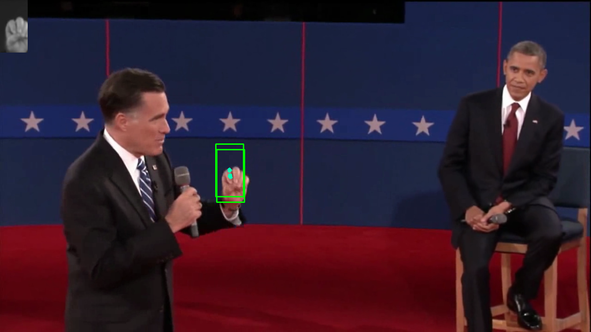

### B

Image patch used for tracking:

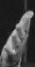

Image frame #15:

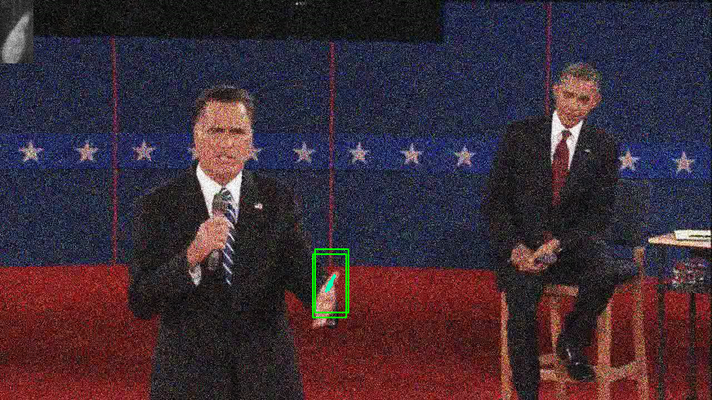

Image frame #50:

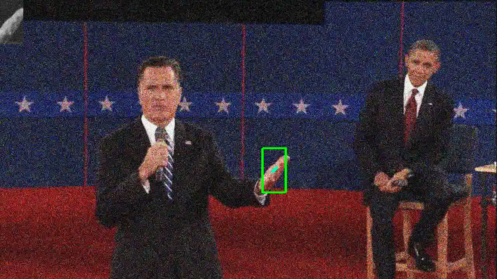

Image frame #140:

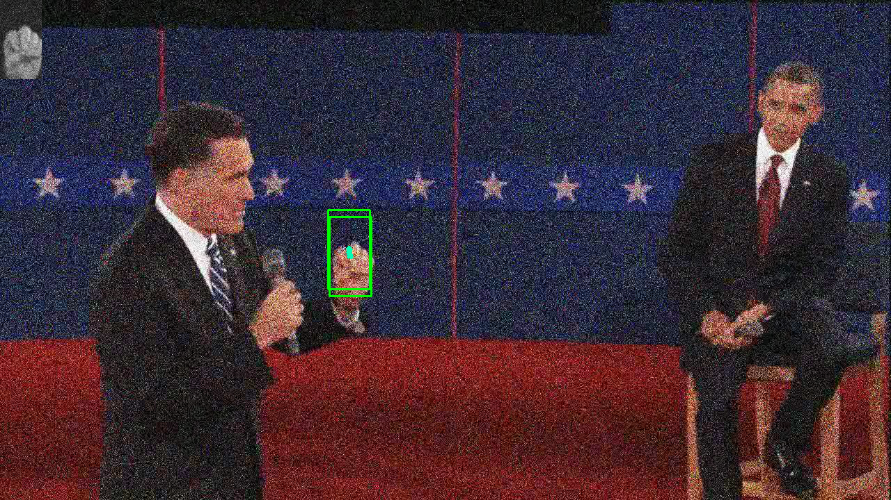

## Question 3

### A

Image patch used for tracking:

Image frame #28:

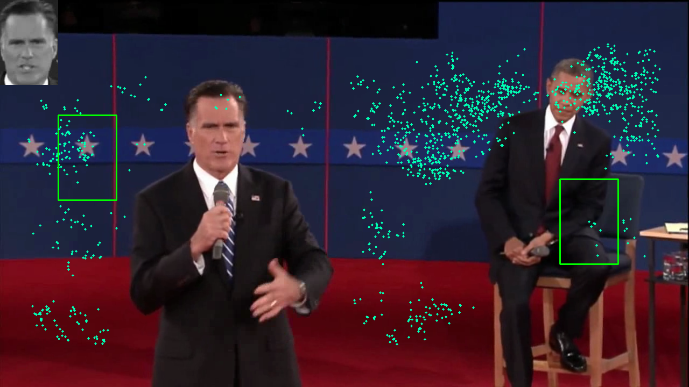

Image frame #84:

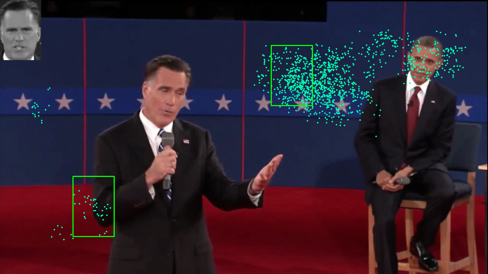

Image frame #144:

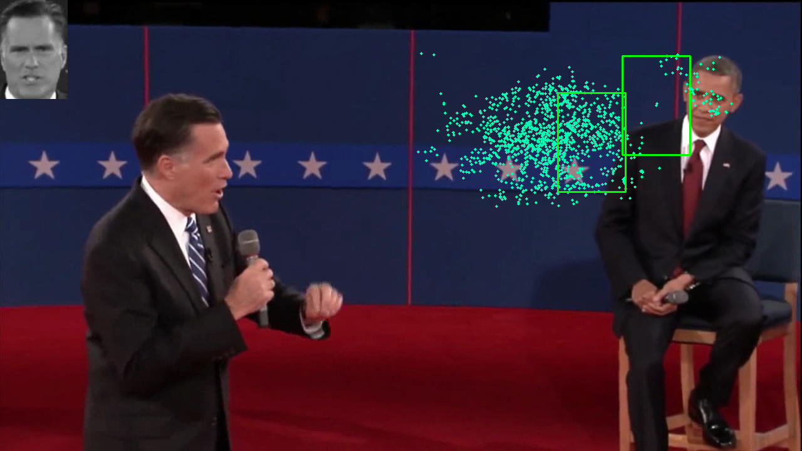

## Question 3

### B

Image patch used for tracking:

Image frame #28:

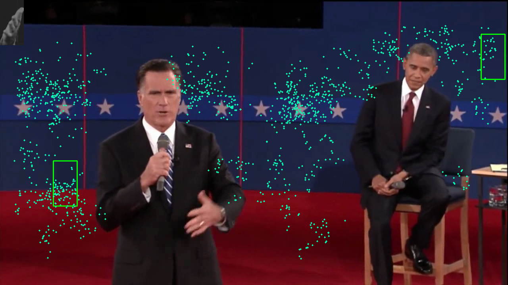

Image frame #84:

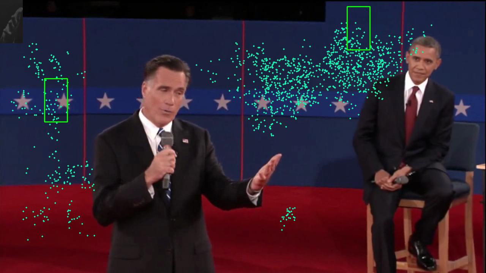

Image frame #144:

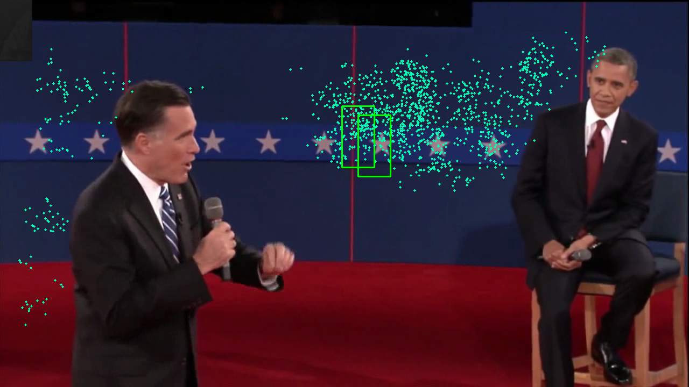