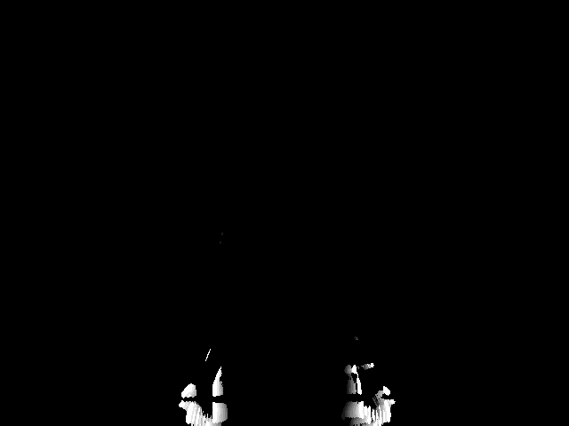
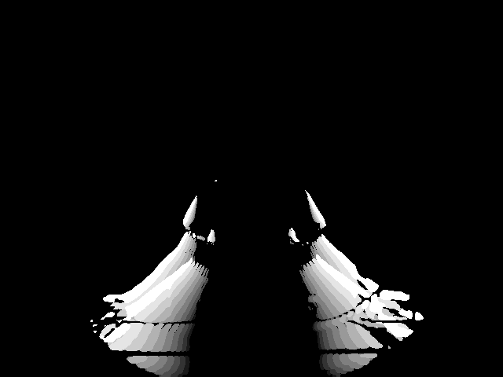
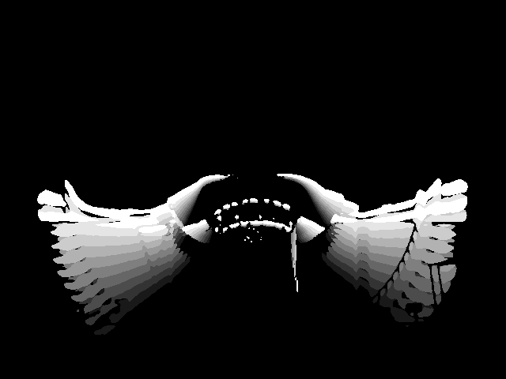
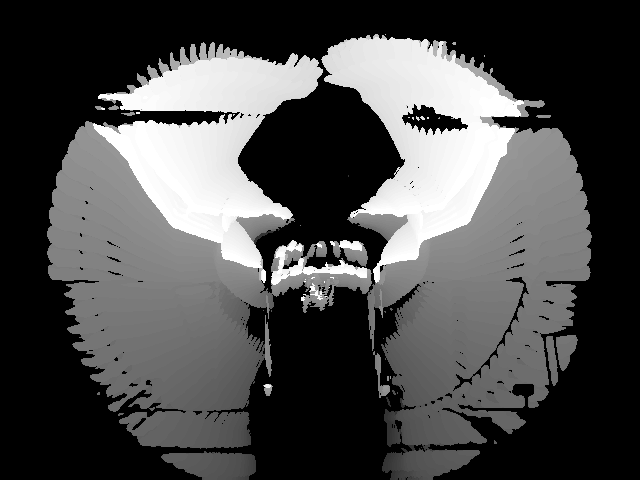
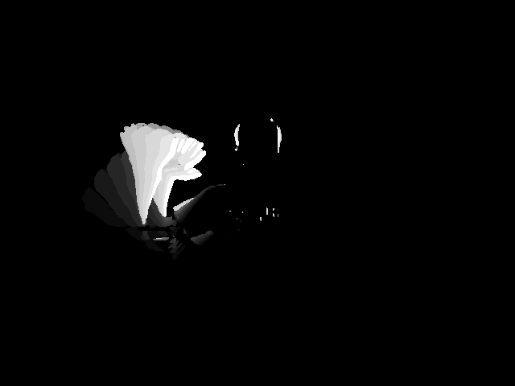
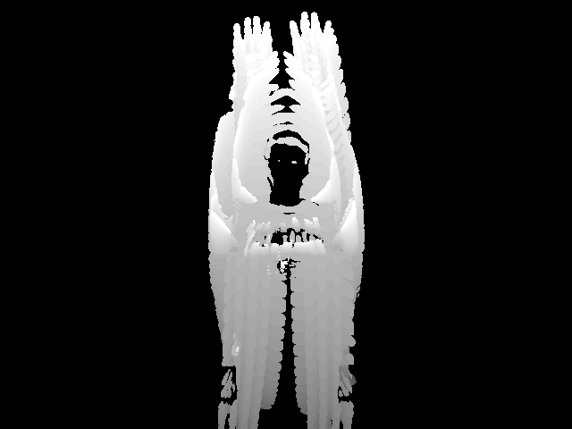
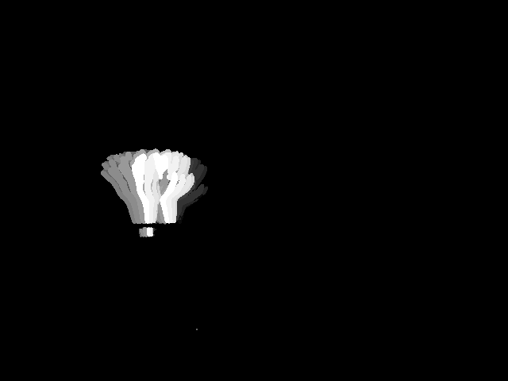
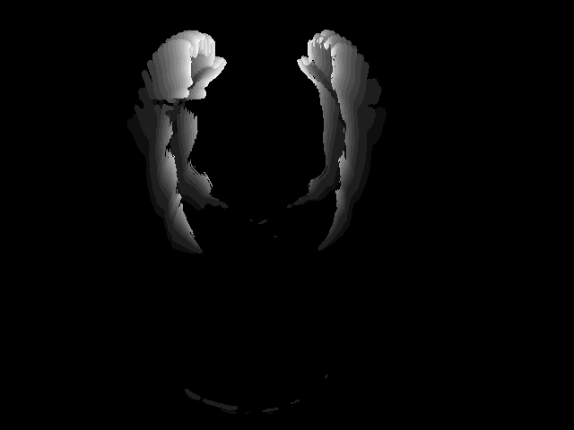
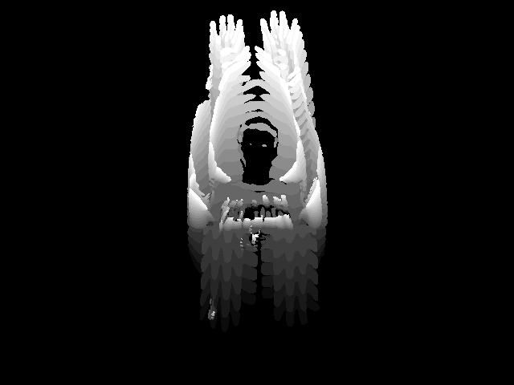

# Problem Set 7: Motion History Images

## Question 1

### A

t = 10:



t = 20:



t = 30:



### B

A1 (`tau = 100`) :



A2 (`tau = 20`):



A3 (`tau = 50`):



## Question 2

### A

```
a, b, c = PS7A1P2T1, PS7A2P2T1, PS7A3P2T1
i, j, k = PS7A1P1T1, PS7A2P1T1, PS7A3P1T1

[[(a,k),(b,k),(c,k)],
[(a,j),(b,j),(c,j)],
[(a,i),(b,i),(c,i)]]

[[ 474.85    6.82 1880.62]
[ 398.53   13.41 1781.97]
[ 183.     95.73 1533.1 ]]
```

a:


b:



c:



i:


j:


k:


